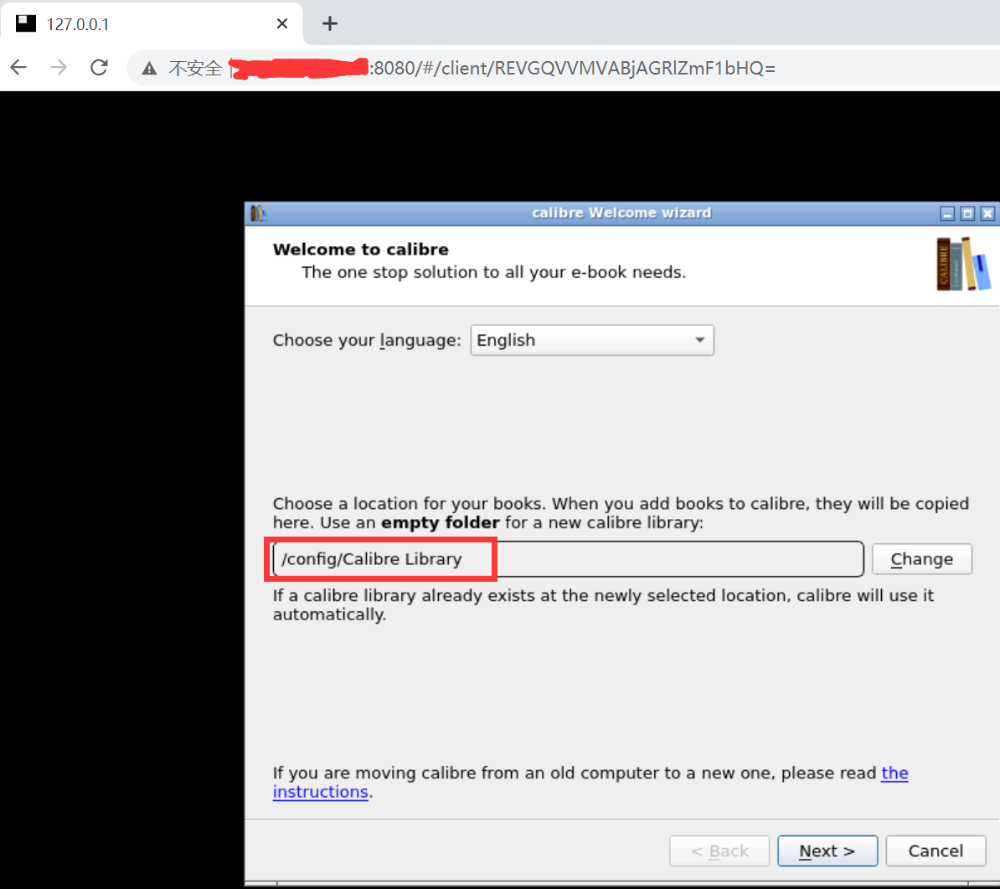
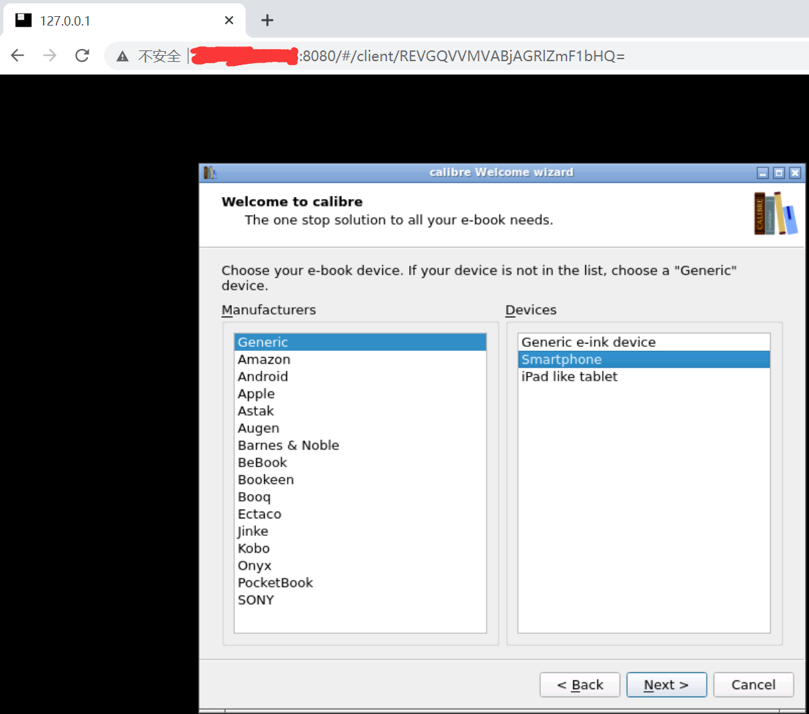
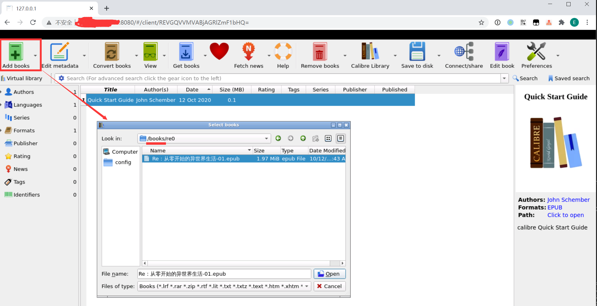
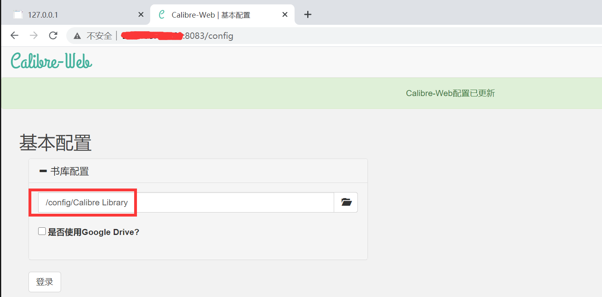
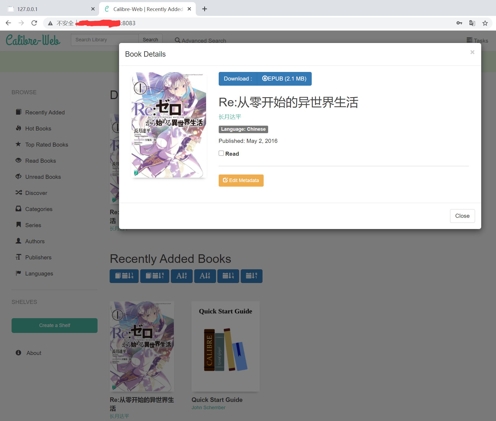
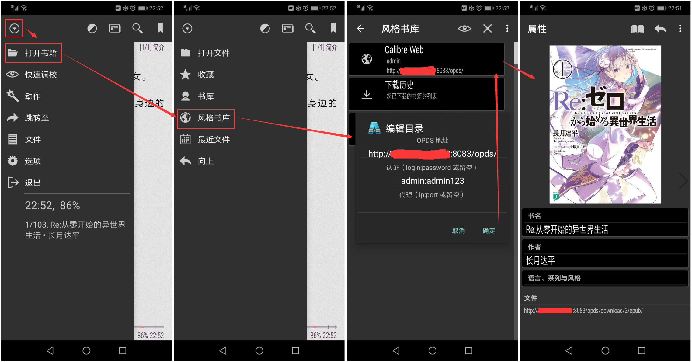

# calibre-docker

> docker 一键部署 calibre 在线书库

------

## 概要

越来越多电子书因为版权问题无法直接在线阅读，而个人收藏下载到本地的图书又不便于随时在线阅读，于是找到了 Calibre ——

- Calibre 是一款强大且易用的电子书本地管理工具，可以在 Windows、macOS 和 Linux 平台搭建个人私人的电子书书库。
- Calibre-web 是 Calibre 的 CMS 界面，用于读取和下载 Calibre 数据库中的电子书，同时它支持 OPDS 协议
- [OPDS](https://en.wikipedia.org/wiki/OPDS) 全称是 Open Publication Distribution System 开放式出版发布系统，是基于 Atom 和 Http 的一种目录格式。OPDS 主要实现 2 个功能：(1) 让电子出版物被发现，可以使用简单的搜索和一些其他的浏览器技术；(2) 让用户下载电子出版物，直接免费下载或进行出售

## TODO 运行效果


## 项目说明

本仓库包含三个 docker 镜像：

| 镜像 | 用途 | 服务端口 | 端口说明 |
|:------:|:------:|:------:|:------|
| [calibre](https://github.com/kovidgoyal/calibre) | calibre 后端 | 8080 | calibre 管理页面 |
| [calibre-web](https://github.com/janeczku/calibre-web) | calibre 前端 | 8083 | CMS 页面，同时提供 OPDS 服务 |
| [nginx](https://www.nginx.com/) | 反向代理 calibre 服务 | 80 | 项目说明页面 |


## 环境要求

  


## 部署步骤

### 1. 项目构建

- 宿主机安装 docker、docker-compose
- 宿主机安全组/防火墙（iptables/firewall）放行这些端口的入口流量： 80、8080、8081、8083
- 下载仓库： `git clone -b main --single-branch https://github.com/lyy289065406/calibre-docker /usr/local/calibre-docker`
- 打开仓库目录： `cd /usr/local/calibre-docker`
- 构建镜像并运行： `./run.sh -u admin -p admin123` （完全启动约需要 2 分钟）

> 构建时设置的是 calibre 后端管理页面的账密，calibre-web 前端账密只能在 CMS 上修改。


### 2. 配置 calibre

- 登录后端管理页面：`http://${vps-ip}/mgr/`（或 `http://${vps-ip}:8080`）
- 默认登录账密: `admin / admin123`
- 参考下图，根据向导进行初始化设置（必须记得配置路径为 `/config/Calibre Library`，该路径用于存储 calibre 的配置库，默认挂载到宿主机的 [`data`](data) 目录）






### 3. 导入本地电子书

先把电子书上传到宿主机的 [`books`](books) 目录，然后登录后台管理页面，点击【Add books】，在【/books】目录找到所上传的电子书，点击【Open】即可导入到 calibre 数据库。

> 可以把个人电子书存储到另一个 Repo（如 [ebooks-library](https://github.com/lyy289065406/ebooks-library)），使用时再通过 git clone 拉取到 [`books`](books) 目录




### 4. 配置 calibre-web

- 登录前端 CMS 页面：`http://${vps-ip}/cms/`（或 `http://${vps-ip}:8083`）
- 默认登录账密: `admin / admin123`
- 根据向导设置 calibre 配置库路径，路径就是前面的 `/config/Calibre Library`
- 成功登录后即可看到在后端管理页面导入的电子书

> 点击右上角的 【admin】 即可修改用户密码






### 5. 在移动设备在线阅读

calibre-web 提供了 OPDS 协议的服务地址：`http://${vps-ip}/cms/opds/`（或 `http://${vps-ip}:8083/opds/`）。

换言之所有支持 OPDS 协议的 APP 都可以对接到 calibre-web 获取书库中的电子书，例如这些 APP ：

| APP | 适用设备/系统 | 说明 |
|:---:|:---:|:---|
| [FullReader](https://play.google.com/store/apps/details?id=com.fullreader&hl=zh_CN) | Android | 界面清新但是有广告 |
| [AIReader](https://play.google.com/store/apps/details?id=com.neverland.alreader&hl=en&gl=US) | Android | 没有广告但是外观不好看 |
| [AIReader](https://play.google.com/store/apps/details?id=com.neverland.alreader&hl=en&gl=US) | Android | 没有广告但是外观不好看 |
| kindle | kindle | 仅 kindle 设备支持 OPDS，Android 版不支持 |
| kybook3 | iPhone | 原作者已停更 |


以 [AIReader](https://play.google.com/store/apps/details?id=com.neverland.alreader&hl=en&gl=US) 为例：点击【打开书籍】->【风格书库】->【添加目录】，填写 OPDS 服务地址即可。 




## 目录结构说明

```
calibre-docker
├── books
├── calibre
│   ├── cms
│   │   └── Dockerfile
│   └── mgr
│       └── Dockerfile
├── data
├── docker-compose.yml
├── imgs
├── index.html
├── nginx
│   ├── etc
│   │   └── calibre_site.conf
│   └── html
├── README.md
├── run.sh
└── stop.sh
```