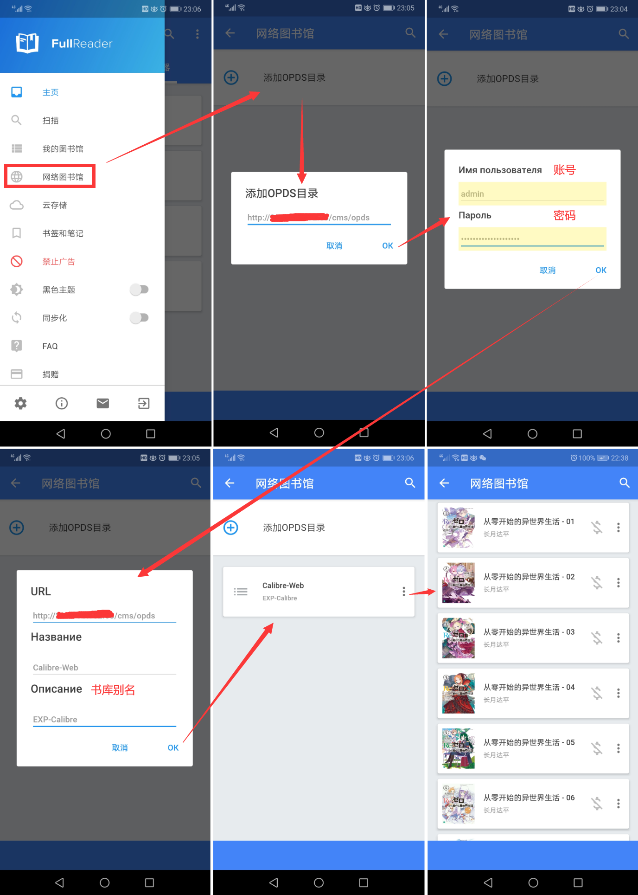

# calibre-docker

> docker 一键部署 calibre 在线书库

------

## 概要

你是否面临以下困扰：

- 想翻看曾经看过的某本小说的时候，网上已经找不到了
- 即使网上找到了，因为版权原因无法在线看、甚至无法下载
- 可以在线看，但是要收费
- 连载小说几个月才出一册，囤了一年后却不知道自己看到哪了
- 在家看小说看了一半突然要出门，打算在路上看，于是不得不把小说发送到手机
- ......

其实只需要搭建一个私人书库，这些问题就迎刃而解了：

- Calibre： 一款强大且易用的电子书本地管理工具，可以在 Windows、macOS 和 Linux 平台搭建个人私人的电子书书库。
- Calibre-web： Calibre 的 CMS 界面，用于读取和下载 Calibre 数据库中的电子书，同时它支持 OPDS 协议
- [OPDS](https://en.wikipedia.org/wiki/OPDS)： 全称是 Open Publication Distribution System 开放式出版发布系统，是基于 Atom 和 Http 的一种目录格式。OPDS 主要实现 2 个功能：(1) 让电子出版物被发现，可以使用简单的搜索和一些其他的浏览器技术；(2) 让用户下载电子出版物，直接免费下载或进行出售


## 项目说明

本仓库包含三个 docker 镜像：

| 镜像 | 用途 | 服务端口 | 端口说明 |
|:------:|:------:|:------:|:------|
| [calibre](https://github.com/kovidgoyal/calibre) | calibre 后端 | 8080 | calibre 管理页面 |
| [calibre-web](https://github.com/janeczku/calibre-web) | calibre 前端 | 8083 | CMS 页面，同时提供 OPDS 服务 |
| [nginx](https://www.nginx.com/) | 反向代理 calibre 服务 | 80 | 项目说明页面 |


## 目录结构说明

```
calibre-docker
├── books ....................... 缓存目录：导入电子书到 calibre 时，仅可以选择在该目录下的电子书
├── data ........................ 存档目录：calibre 的数据库（包括电子书本身），用于数据迁移
├── calibre
│   ├── cms
│   │   └── Dockerfile .......... calibre 前端镜像构建脚本
│   └── mgr
│       └── Dockerfile .......... calibre 后端镜像构建脚本
├── nginx
│   ├── etc
│   │   └── calibre_site.conf ... 代理服务配置
│   └── html .................... 代理服务主页
├── index.html .................. Github Paget：自动跳转到代理服务主页
├── docker-compose.yml .......... calibre 镜像构建脚本
├── run.sh ...................... calibre 服务一键启动脚本
├── stop.sh ..................... calibre 服务一键停止脚本
├── imgs ........................ README 插图目录
└── README.md ................... 本仓库说明文档
```


## 环境要求

  


## 部署步骤

### 1. 项目构建

- 宿主机安装 docker、docker-compose
- 宿主机安全组/防火墙（iptables/firewall）放行这些端口的入口流量： 80、8080、8081、8083
- 下载仓库： `git clone -b main --single-branch https://github.com/lyy289065406/calibre-docker /usr/local/calibre-docker` （只下载 main 主分支即可）
- 打开仓库目录： `cd /usr/local/calibre-docker`
- 构建镜像并运行： `./run.sh -u admin -p admin123` （完全启动约需要 2 分钟）

> 构建时设置的是 calibre 后端管理页面的账密，calibre-web 前端账密只能在 CMS 上修改。


### 2. 配置 calibre

- 登录后端管理页面：`http://${vps-ip}/mgr/`（或 `http://${vps-ip}:8080`）
- 默认登录账密: `admin / admin123`
- 参考下图，根据向导进行初始化设置（必须记得配置路径为 `/config/Calibre Library`，该路径用于存储 calibre 的配置库，默认挂载到宿主机的 [`data`](data) 目录）


### 3. 导入本地电子书

先把电子书上传到宿主机的 [`books`](books) 目录，然后登录后台管理页面，点击【Add books】，在【/books】目录找到所上传的电子书，点击【Open】即可导入到 calibre 数据库。

> 可以把个人电子书存储到另一个 Repo（如 [ebooks-library](https://github.com/lyy289065406/ebooks-library)），使用时再通过 git clone 拉取到 [`books`](books) 目录


### 4. 配置 calibre-web

- 登录前端 CMS 页面：`http://${vps-ip}/cms/`（或 `http://${vps-ip}:8083`）
- 默认登录账密: `admin / admin123`
- 根据向导设置 calibre 配置库路径，路径就是前面的 `/config/Calibre Library`
- 成功登录后即可看到在后端管理页面导入的电子书

> 点击右上角的 【admin】 即可修改用户密码


## 阅读设置

### 1. PC 阅读

默认情况下 admin 用户是无法在线阅读电子书的，需要先授权阅读权限：

点击右上角的【管理权限】，编辑【admin】用户，勾选【允许在线阅读】即可。

之后点击任意一本电子书，会多出一个【在线阅读】按钮：


### 2. 手机阅读

calibre-web 提供了 OPDS 协议的服务地址：`http://${vps-ip}/cms/opds/`（或 `http://${vps-ip}:8083/opds/`）。

换言之所有支持 OPDS 协议的 APP 都可以对接到 calibre-web 获取书库中的电子书，例如这些 APP ：

| APP | 适用设备/系统 | 说明 |
|:---:|:---:|:---|
| [FullReader](https://play.google.com/store/apps/details?id=com.fullreader&hl=zh_CN) | Android | 界面清新但是有广告，而且汉化不完全，有少量韩文 |
| [AIReader](https://play.google.com/store/apps/details?id=com.neverland.alreader&hl=en&gl=US) | Android | 没有广告但是外观不好看 |
| [AIReader](https://play.google.com/store/apps/details?id=com.neverland.alreader&hl=en&gl=US) | Android | 没有广告但是外观不好看 |
| kindle | kindle | 仅 kindle 设备支持 OPDS，Android 版不支持 |
| kybook3 | iPhone | 原作者已停更 |


以 [FullReader](https://play.google.com/store/apps/details?id=com.fullreader&hl=zh_CN) 为例：点击【网络图书馆】->【添加OPDS目录】，填写 calibre 的 OPDS 服务地址和 BasicAuth 账号密码即可。




## FAQ 

### Q1. 迁移 data 目录的数据库后无法运行 CMS 服务

理论上 data 目录挂载了 calibre 运行所需的全部数据（包括电子书本身），只要完整迁移到任何设备就可以直接运行。

但若 calibre 非正常停止过，就会导致 calibre-web （即 CMS 服务）无法运行。

解决方法也很简单：

- 执行 [`stop.sh`](stop.sh) 脚本停止 calibre 服务
- 查看 [`data/.config/calibre/gui.json`](data/.config/calibre/gui.json) 的 `library_usage_stats` 状态值是否为 `1`，若不是则修改为 `1`
- 执行 [`run.sh`](stop.sh) 脚本重新启动 calibre 服务，此时 CMS 服务应该可以正常启动了


### Q2. 项目仓库太大无法下载到本地

本仓库包含 main 和 produce 两个分支，其中：

- main： 干净分支，纯粹用于构建私人书库
- produce： 我的生产环境分支，归档了我的个人书库数据，而且会越来越大

因此 produce 分支是不需要下载的，只下载 main 主分支即可：

`git clone -b main --single-branch https://github.com/lyy289065406/calibre-docker`
